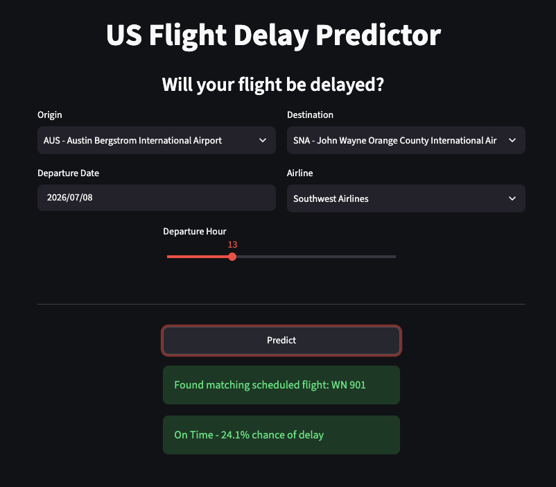

## 1. Project Overview

The app predicts a probability of flight delay based on 7 key pieces of information that the user has to enter.

Select your origin, destination, departure date, and airline from the four respective dropdowns.

Use the slider to enter in departure hour (in accordance to the origin airport's local time)

Once the user hits the Predict button the app takes care of the rest by pinging the Open-Meteo API to get information on what the weather conditions at the origin airport are and consolidates all other user inputted data to pass off to the model in order to make a prediction!

The app also uses a polynomial regression model to predict the duration of an outgoing flight.

Please note:

- Live flight matching uses AeroDataBox's free-tier schedule API (600 API units a month, 2400 requests a month), which has good but not complete coverage - some real flights may not appear in results
- Live inbound flight tracking is available for outgoing flights that haven't landed at the origin airport.
- It only works on flights travelling within the United States.

Live Demo Link: https://us-flight-delay.streamlit.app/

## 2. Dataset

I gathered 16 months' worth of flight data from January 2025 to April 2026, totalling over 9 million flights.

I also gathered data about airport metadata like coordinates, name, iso_region for each one of the unique origin airports in the 9 million flight records.

This facilitated the process to look up the weather metrics based on origin airport latitude and longitude, the departure date, and the local time

BTS On-Time: Reporting Carrier On-Time Performance (1987-present): https://www.transtats.bts.gov/DL_SelectFields.aspx?gnoyr_VQ=FGJ&QO_fu146_anzr=b0-gvzr

Airports CSV File: https://ourairports.com/data/

Open-Meteo Weather API: https://open-meteo.com/en/docs/historical-weather-api

## 3. Features Engineered

date: DEPARTURE_HOUR, DAY_OF_WEEK, MONTH, IS_HOLIDAY_PERIOD, CRS_ELAPSED_TIME

weather: wind_gusts, precipitation, cloud_cover_low, weather_code, rain, temperature, wind_speed, snowfall

distance: DISTANCE

congestion: ORIGIN_HOURLY_FLIGHTS, DEST_HOURLY_FLIGHTS, ROUTE_HOURLY_FLIGHTS

delay rate: CARRIER_DELAY_RATE, ORIGIN_DELAY_RATE, ROUTE_DELAY_RATE, DEST_DELAY_RATE

encodings: ORIGIN_ENCODED, DEST_ENCODED, ROUTE_ENCODED, ORIGIN_STATE_ABR, DEST_STATE_ABR, OP_UNIQUE_CARRIER

Any information related to origin, destination, and route are key pieces of information to be passed off to the machine learning model to make a prediction.

Machine learning model don't understand plain text, but they do understand numbers.

I assigned numerical categories for each origin, destination, and route, and carrier using the respective TargetEncoders

Information related to airline, the origin state, and destination state were assigned numerical categories with respective LabelEncoders with respective LabelEcnoders.

Information related how many flights are departing from the origin at a given departure hour, how many flights operated on that route in that hour, and how many flights are at the destination at that hour are also important factors when making a prediction.

I grouped together the FL_DATE, DEPARTURE_HOUR, ORIGIN/ROUTE/DEST columns for each ORIGIN/ROUTE/DEST and got the respective counts for each column (ORIGIN_HOURLY_FLIGHT, ROUTE_HOURLY_FLIGHTS, DEST_HOURLY_FLIGHTS).

Historical information regarding airline delay reputation, airport delay reputation, and route delay reputation is also important to look at.

I grouped together the OP_UNIQUE_CARRIER, ORIGIN, DEST, ROUTE columns the figure out the delay rate based on airline, origin airport, destination airport, and route, respectively and create new corresponding columns as such where the ORIGIN, DEST, ROUTE columns was mapped to its respective delay rate.

# 4. Model

I used my validation set on the LightGBM model. I used Optuna to tune model hyperparameters and optimized for the highest F0.5 score

Metrics: 74.6% AUC-ROC, 80% accuracy, 66.3% FNR and 7% FPR.

Having a higher false negative rate than a false positive rate is a design choice that I made as I don't want users to be missing on-time flights thinking that they are delayed.

# 5. Future Improvements

Access to more months worth of flight data (from 2024)

Air Traffic Controller data corresponding to each one of the over 9 million flights in the dataset

Feature engineering how many flights are scheduled to land at the destination airport when the current flight is scheduled to land

CatBoost ensemble algorithm

## 6. Data Sources

- BTS On-Time Performance data (public domain, U.S. Dept. of Transportation)
- Airport metadata: OurAirports (public domain)
- Historical weather: Open-Meteo (CC BY 4.0 — attribution required)
- Live flight schedules: AeroDataBox (free tier, subject to their Terms of Service)
